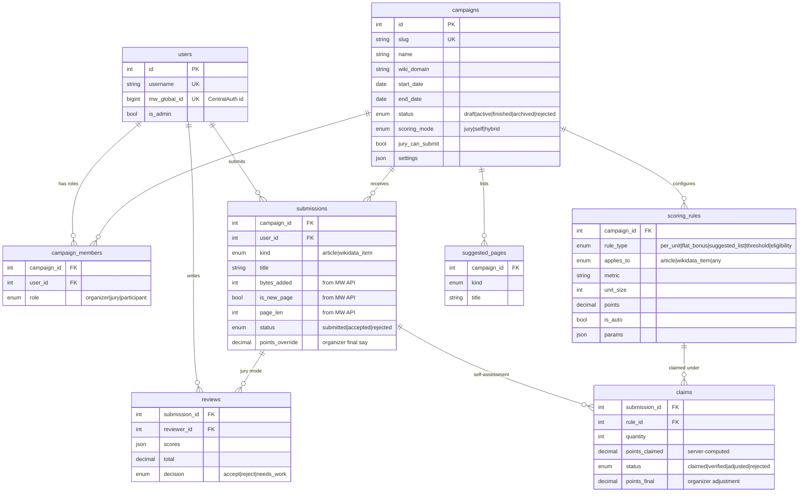

# WikiSTAR v2 — Architecture & Database Schema

Greenfield rewrite. The v1 Flask/Vue code is preserved on the `legacy-v1`
branch.

## Stack

| Layer     | Technology |
|-----------|------------|
| Backend   | FastAPI + SQLAlchemy 2.0 (Python 3.12, managed with `uv`) |
| Database  | MariaDB/MySQL (SQLite for local dev) |
| Auth      | MediaWiki OAuth 2.0 via Authlib (Starlette client), signed session cookie |
| Frontend  | Vue 3 + Vite + Pinia + Bootstrap 5 |

## Design principles (fixes for v1's flaws)

1. **Identity only from the session.** v1 trusted usernames sent in request
   bodies (anyone could judge as anyone, and unknown creators were
   auto-created as admins). Every v2 endpoint derives the user from the
   OAuth session cookie.
2. **Per-campaign roles.** v1 had one global role per user. v2 stores roles
   in `campaign_members` — the same person can organize one campaign,
   judge another and participate in a third. The only global flag is
   `users.is_admin`.
3. **No stored derived data.** v1 stored `article.points` (overwritten by
   the last juror) and a stats table that was never updated. v2 computes
   points live from reviews/claims; the only stored point value is
   `submissions.points_override` — the organizers' explicit final say.
4. **One write path per action.** v1 had three endpoints to record a
   review and two to submit an article. v2 has exactly one of each,
   with upserts keyed by unique constraints.
5. **Typed, constrained schema.** Unique constraints on
   (submission, reviewer), (submission, rule), (campaign, user, role),
   (campaign, user, title); FK cascades; enums for every state field;
   structured JSON only for display-level settings.
6. **Verified wiki data.** Submissions snapshot page metadata (bytes added
   by the participant during the campaign window, new-page detection,
   page size) from the MediaWiki API instead of trusting input.

## Entity–relationship diagram



Plus `audit_logs` (user_id, action, entity_type, entity_id, details JSON).

## Scoring modes

* **jury** — classic editathon: jurors file one review per submission
  (unique constraint); the submission's points are the average of
  accepting reviews.
* **self** — self-assessment: participants file claims against the
  campaign's scoring rules; point values are always recomputed
  server-side (`scoring.claim_points`). Automatic rules (bytes added,
  suggested-list bonus) need no claim at all. Organizers verify, adjust
  or reject claims, and can override a submission's total outright.
* **hybrid** — self-assessment claims plus jury verification workflow.

### Rule vocabulary (`scoring_rules`)

| rule_type | Meaning | Example (default preset) |
|---|---|---|
| `per_unit` | points per unit of a metric; `params.rounding`: floor/nearest; optional `max_units` cap | +1 / 1,000 bytes (nearest); +1 / 5 statements; +1 / 3 references |
| `flat_bonus` | fixed points when claimed/detected | +2 substantial improvement, +25 Good Article, +3 item created |
| `suggested_list` | fixed points when the title is on `suggested_pages` (automatic) | +10 suggested article, +5 suggested item |
| `threshold` | gate, no points | new article must be ≥ 3,500 bytes to earn size points |
| `eligibility` | topical constraint shown to users | item must match P17=Q668 / P407=Q36236 / … |

The default preset (`backend/scoring.py:default_self_assessment_rules`)
encodes the documented rule set and is fully editable per campaign.
`tests/test_scoring.py` pins the engine to every worked example from the
documentation (4,100-byte translation → 4 pts; 3,900 bytes + improvement
→ 6 pts; suggested + 5,000 bytes + improvement → 17 pts; suggested item
+ 10 statements → 10 pts; …).

## Backend layout

Python files live at the repository root because Toolforge's classic
python webservice serves directly from `~/www/python/src` and expects
`app.py` there. `app.py` exposes both the ASGI app (`app`, for
uvicorn/build service) and a WSGI adapter (`application`, for uwsgi).

```
app.py         entry point: app assembly, session middleware, SPA serving
config.py      config.toml + env vars
db.py          engine / session / Base
models.py      the schema above (SQLAlchemy 2.0 typed mappings)
schemas.py     pydantic request/response models (API contract)
auth.py        OAuth 2.0 flow + require_user/require_admin/
               require_organizer/require_jury dependencies
scoring.py     rule engine + default preset
mediawiki.py   read-only MW API client (page info, byte deltas,
               new-page detection)
routers/
  auth.py         /api/login /oauth-callback /api/logout /api/me   [done]
  campaigns.py    CRUD, approve/reject, leaderboard                [phase 2]
  submissions.py  submit, list, refresh metadata, moderate         [phase 2]
  reviews.py      single upsert write path for jury reviews        [phase 2]
  claims.py       claim upsert + organizer moderation              [phase 2]
  admin.py        stats, audit log, user admin                     [phase 2]
```

## API surface

Interactive docs at `/docs` (OpenAPI). All state-changing routes require
the session cookie; role checks are enforced per campaign.

## Running

```bash
uv sync
uv run uvicorn app:app --reload            # http://localhost:8000
cd frontend && pnpm install && pnpm dev    # http://localhost:5173 (proxies /api)
uv run pytest                              # scoring engine tests
```
